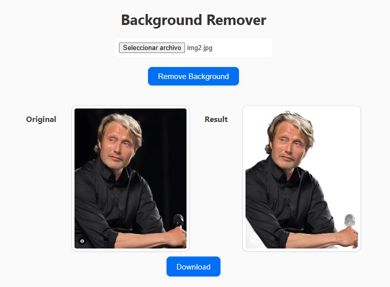

# RM-BACKGROUND

This was mainly made because i hate ads in bg remover pages when I need a clean image. It took me not too much, saved me a lot of headeaches, not so great css.

## How It Works

1. Upload an image directly in your browser.
2. A pre-trained WASM model processes the image locally — no server needed.
3. Download the result as a transparent PNG.

## For local

1. Clone this repo

```bash
git clone
```

2. Install dependency

```bash
npm install
```

3. Now you can run it with local server or something similar.


